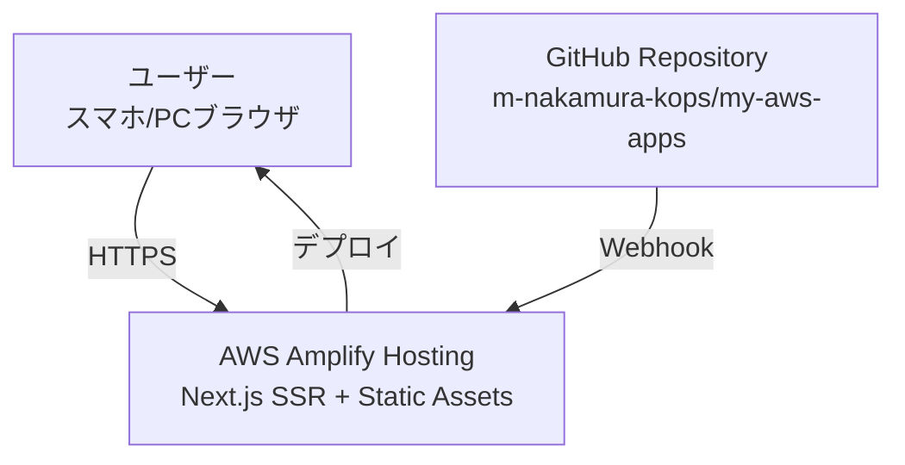
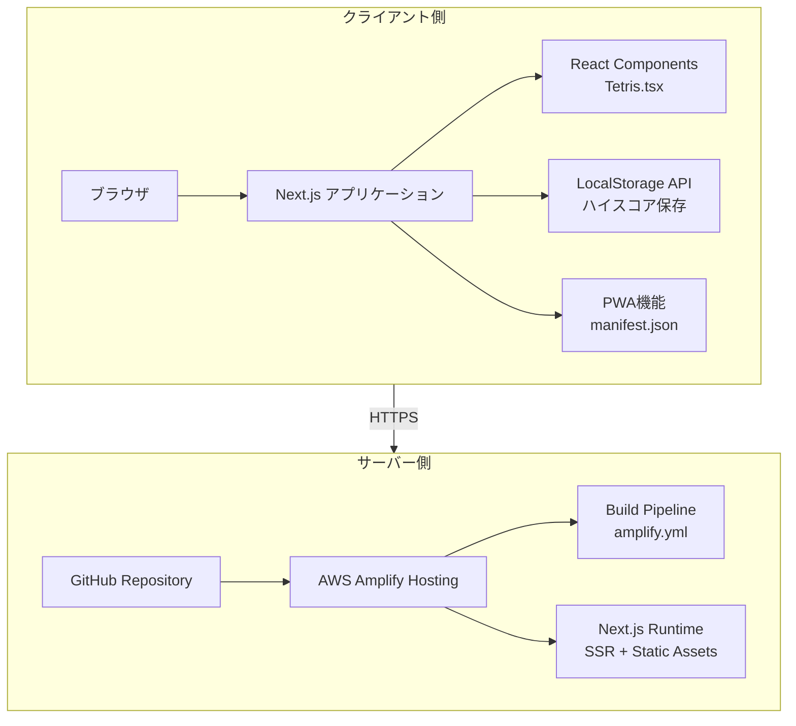
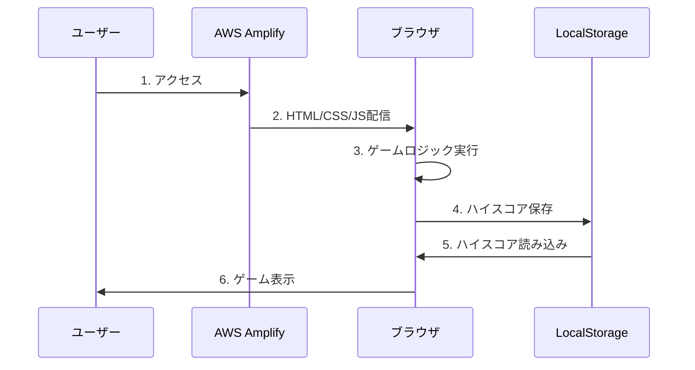
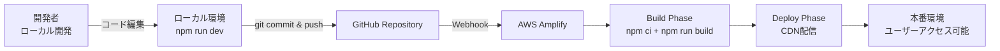
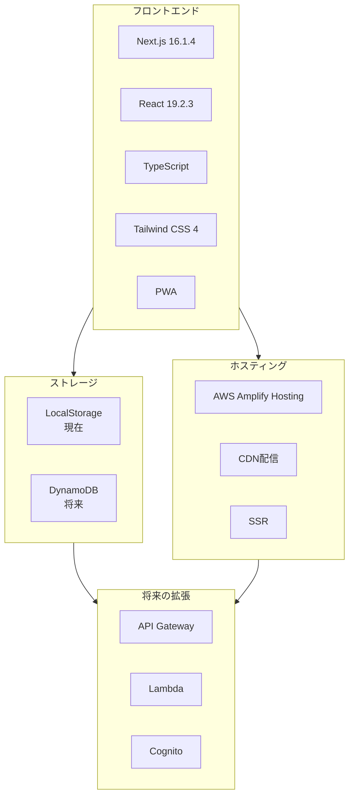
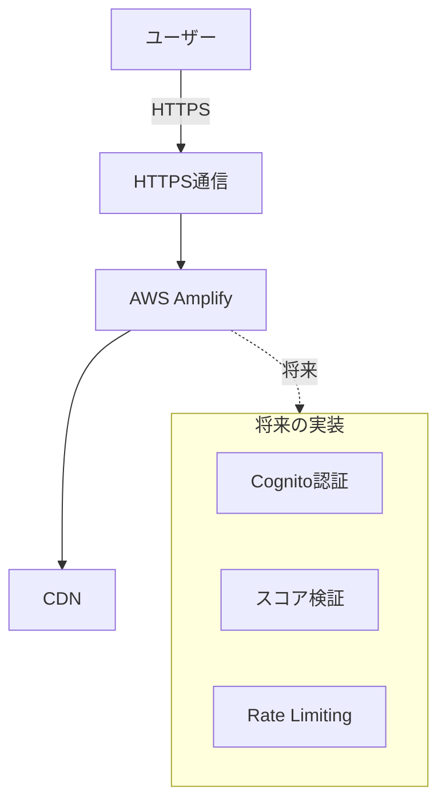
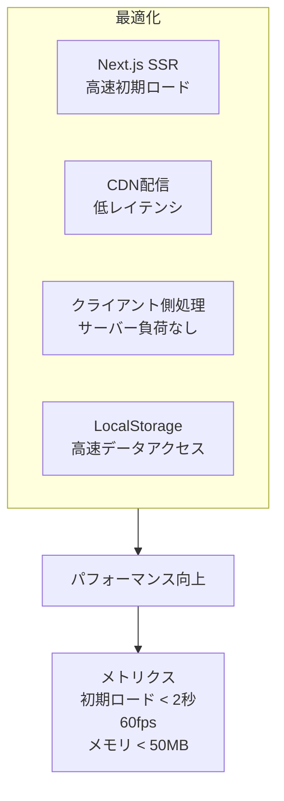

# テトリスアプリ システム構成図（Mermaid形式）

## 全体構成図

```mermaid
graph TB
    User[ユーザー<br/>スマホ/PCブラウザ]
    Amplify[AWS Amplify Hosting<br/>Next.js SSR + Static Assets]
    GitHub[GitHub Repository<br/>m-nakamura-kops/my-aws-apps]
    
    User -->|HTTPS| Amplify
    GitHub -->|Webhook| Amplify
    Amplify -->|デプロイ| User
```

## 詳細構成図

```mermaid
graph TB
    subgraph Client[クライアント側]
        Browser[ブラウザ]
        App[Next.js アプリケーション]
        Component[React Components<br/>Tetris.tsx]
        Storage[LocalStorage API<br/>ハイスコア保存]
        PWA[PWA機能<br/>manifest.json]
        
        Browser --> App
        App --> Component
        App --> Storage
        App --> PWA
    end
    
    subgraph Server[サーバー側]
        Amplify[AWS Amplify Hosting]
        Build[Build Pipeline<br/>amplify.yml]
        Runtime[Next.js Runtime<br/>SSR + Static Assets]
        GitHub[GitHub Repository]
        
        Amplify --> Build
        Amplify --> Runtime
        GitHub --> Amplify
    end
    
    Client -->|HTTPS| Server
```

## データフロー図

```mermaid
sequenceDiagram
    participant User as ユーザー
    participant Amplify as AWS Amplify
    participant Browser as ブラウザ
    participant Storage as LocalStorage
    
    User->>Amplify: 1. アクセス
    Amplify->>Browser: 2. HTML/CSS/JS配信
    Browser->>Browser: 3. ゲームロジック実行
    Browser->>Storage: 4. ハイスコア保存
    Storage->>Browser: 5. ハイスコア読み込み
    Browser->>User: 6. ゲーム表示
```

## デプロイフロー図

```mermaid
graph LR
    Dev[開発者<br/>ローカル開発]
    Local[ローカル環境<br/>npm run dev]
    GitHub[GitHub Repository]
    Amplify[AWS Amplify]
    Build[Build Phase<br/>npm ci + npm run build]
    Deploy[Deploy Phase<br/>CDN配信]
    Prod[本番環境<br/>ユーザーアクセス可能]
    
    Dev -->|コード編集| Local
    Local -->|git commit & push| GitHub
    GitHub -->|Webhook| Amplify
    Amplify --> Build
    Build --> Deploy
    Deploy --> Prod
```

## 技術スタック図

```mermaid
graph TB
    subgraph Frontend[フロントエンド]
        NextJS[Next.js 16.1.4]
        React[React 19.2.3]
        TS[TypeScript]
        Tailwind[Tailwind CSS 4]
        PWA2[PWA]
    end
    
    subgraph Hosting[ホスティング]
        Amplify2[AWS Amplify Hosting]
        CDN[CDN配信]
        SSR[SSR]
    end
    
    subgraph Storage[ストレージ]
        LocalStorage2[LocalStorage<br/>現在]
        DynamoDB[DynamoDB<br/>将来]
    end
    
    subgraph Future[将来の拡張]
        API[API Gateway]
        Lambda[Lambda]
        Cognito[Cognito]
    end
    
    Frontend --> Hosting
    Frontend --> Storage
    Storage --> Future
    Hosting --> Future
```

## セキュリティ構成図

```mermaid
graph TB
    User2[ユーザー]
    HTTPS[HTTPS通信]
    Amplify3[AWS Amplify]
    CDN2[CDN]
    
    User2 -->|HTTPS| HTTPS
    HTTPS --> Amplify3
    Amplify3 --> CDN2
    
    subgraph Future2[将来の実装]
        Cognito2[Cognito認証]
        Validation[スコア検証]
        RateLimit[Rate Limiting]
    end
    
    Amplify3 -.->|将来| Future2
```

## パフォーマンス最適化図

```mermaid
graph TB
    subgraph Optimization[最適化]
        SSR2[Next.js SSR<br/>高速初期ロード]
        CDN3[CDN配信<br/>低レイテンシ]
        ClientLogic[クライアント側処理<br/>サーバー負荷なし]
        LocalStorage3[LocalStorage<br/>高速データアクセス]
    end
    
    Optimization --> Performance[パフォーマンス向上]
    
    Performance --> Metrics[メトリクス<br/>初期ロード < 2秒<br/>60fps<br/>メモリ < 50MB]
```
